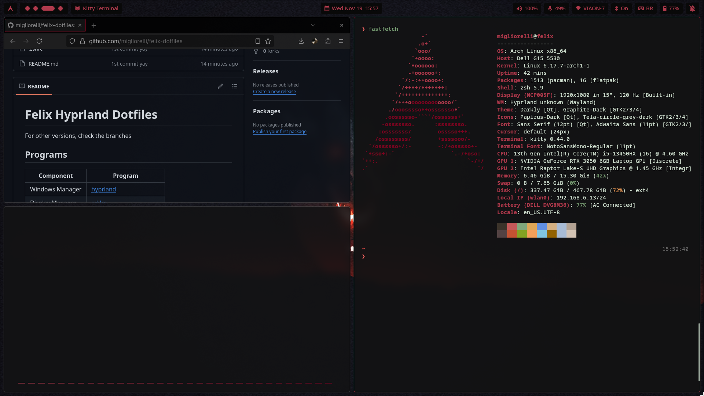

# Felix Hyprland Dotfiles

For other versions, check the branches

## Programs

| Component | Program |
|------------------|------------------|
| Windows Manager  | [hyprland](https://hypr.land/) |
| Display Manager  | [sddm](https://github.com/sddm/sddm) |
| Lockscreen       | [hyprlock](https://github.com/hyprwm/hyprlock) |
| Wallpaper        | [hyprpaper](https://github.com/hyprwm/hyprpaper) |
| Bar              | [hyprpanel](https://hyprpanel.com/) |
| Terminal         | [kitty](https://sw.kovidgoyal.net/kitty/) |
| Shell            | [zsh](https://www.zsh.org/) + [powerlevel10k](https://github.com/romkatv/powerlevel10k) |
| Launcher         | [rofi](https://github.com/davatorium/rofi) + [cliphist](https://github.com/sentriz/cliphist) + [rofi-emoji](https://github.com/Mange/rofi-emoji) |
| Browser          | [firefox](https://www.firefox.com/pt-BR/) |
| File Manager     | [gnome nautilus](https://archlinux.org/packages/extra/x86_64/nautilus/) |
| Code Editor      | [neovim](https://neovim.io/) + [lazyvim](https://www.lazyvim.org/) |
| Screenshot       | [hyprshot](https://github.com/Gustash/Hyprshot) |

## Themes

| Component | Theme |
|----------|-------|
| SDDM     | [sugar candy](https://github.com/vinceliuice/Tela-circle-icon-theme) (customized) |
| GTK      | [graphite gtk dark](https://github.com/vinceliuice/Graphite-gtk-theme) |
| QT       | [graphite kde dark](https://github.com/vinceliuice/Graphite-kde-theme) |
| Icons   | [tela circle grey dark](https://github.com/vinceliuice/Tela-circle-icon-theme) |
| Grub     | [lain theme](https://github.com/uiriansan/LainGrubTheme) |
| Wallpapers | [wallhaven](https://wallhaven.cc/) |

## Other dependencies

| Program |
|----------|
| hypridle |
| wl-paste |
| hyprpicker |
| discord |
| zapzap |

## Screenshots

## Credits

Migliorelli (eophesia)